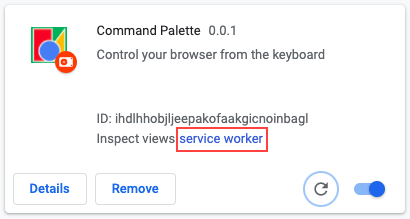

# Resources

## Contents

1. [Getting Started](#getting-started-tutorial)

1. [Useful Command Palette Features](#useful-features-for-a-command-palette)

## [Getting Started Tutorial](https://developer.chrome.com/docs/extensions/mv3/getstarted/)

- Google's developer tutorial for making chrome extensions

## [Useful Features for a Command Palette](https://blog.superhuman.com/how-to-build-a-remarkable-command-palette/)

- A nice article about what a good command palette should do, such as, focus back on previously focused element on cancel/dismiss

ISSUES

1. How to launch popup window by keyboard shortcut
    - add commands `"commands": { "commandName": { "suggested_key": { "default": "[hotkey-command (eg 'Ctrl+Shift+Y')]" } } }`
    - access commands from `background.js` with `chrome.commands.onCommand.addEventListener`
    - popup from hotkey => https://developer.chrome.com/docs/extensions/reference/commands/#action-commands
        - this isn't seeming to work. While the hotkey `Ctrl+Shift+P` logs to the console (of the extension not the current window), the popup doesn't pop up.
        - console of extension 
            
            

1. How to access an element's value in the popup window
    - todo

1. How to get access to the tabs
    - todo
    - [get `document` from current tab ?](https://stackoverflow.com/questions/58695215/how-to-get-document-from-current-tab-in-background-js)
    - [access web-DOM not extension-DOM ?](https://stackoverflow.com/a/4532567)

1. How to add commands extension
    - todo

1. Show a list of available commands in a dropdown list below the input